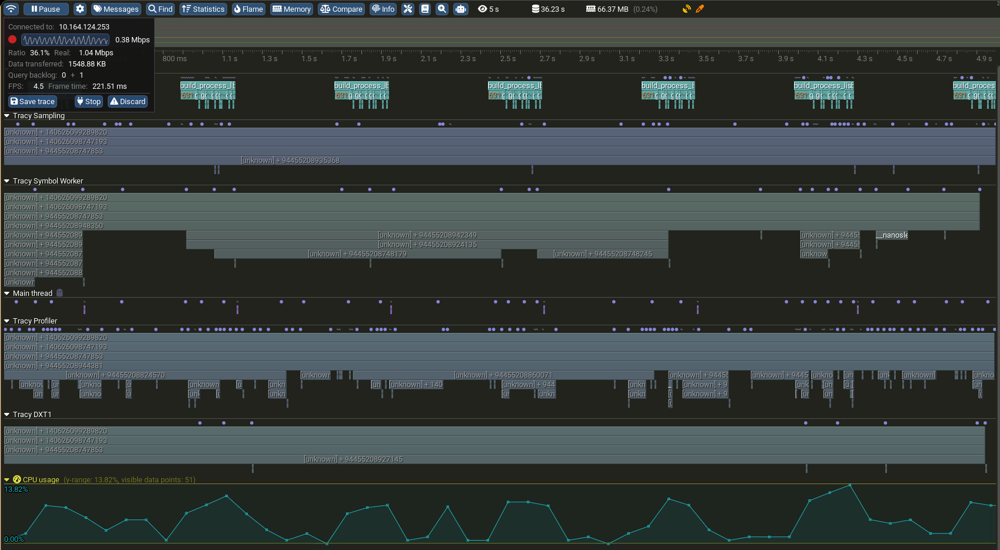
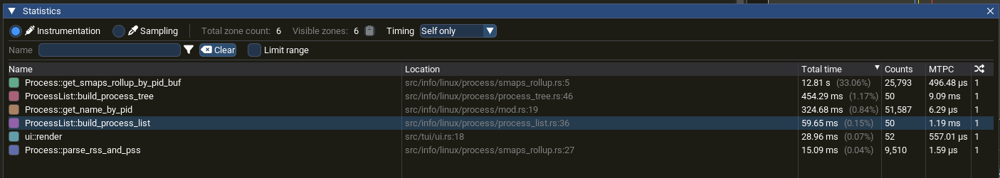

# `memtop` is utility to monitor Linux and system processes


## Process tree mode
<p align="center">
  
</p>

 ones are user space processes  
 └  ones are process' threads  
 ones are kernel threads

## Developing

run without optimizations:
```sh
cargo run
```

build in release mode:
```sh
cargo build --release
```

profiling with Tracy
1. build with profile feature flag:
```sh
cargo build --profile dev
```
2. run
```sh
./target/release-profile/memtop
```

3. build tracy profiler with specific version (13.1)
4. run tracy -> connect to running `memtop`



View statistics of usage


## Architecture:
`memtop` uses a ratatui library for TUI interface
