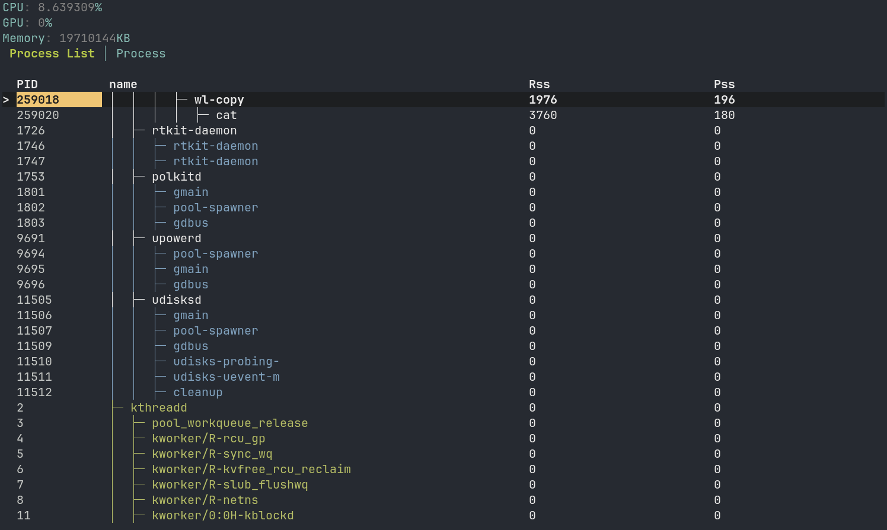

# `memtop` is utility to monitor Linux and system processes


## Process tree mode
<p align="center">
  
</p>

## Developing

run without optimizations:
```sh
cargo run
```

build in release mode:
```sh
cargo build --release
```

## Architecture:
`memtop` uses a ratatui library for TUI interface
